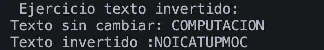
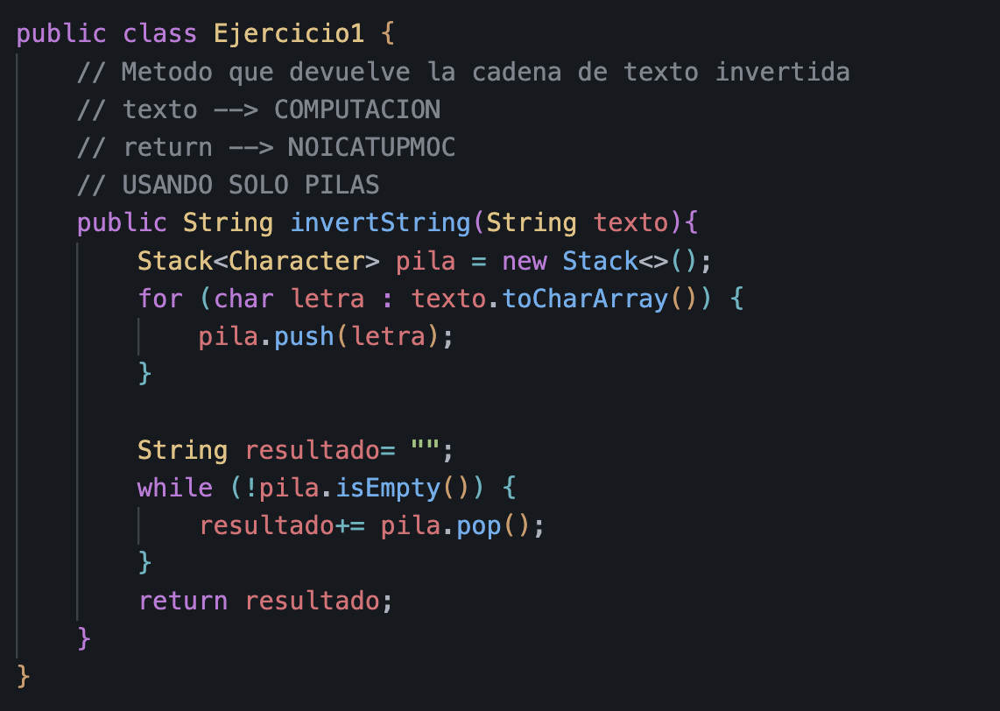

# Práctica: Dinamicas Lineales

## Datos del Estudiante
- **Nombre:** Stephan Axel Cedillo Mendoza
- **Curso:** Estructura de Datos - GRUPO 1
- **Fecha:** 08/06/2024

---

## 1. Linked Lists (Listas Enlazadas)

**Fecha:** 08/06/2024
**Descripción:**

En esta práctica trabajamos con una LinkedList para guardar varios nombres. Primero verificamos si la lista estaba vacía y vimos su tamaño. Después agregamos algunos elementos y utilizamos métodos como getFirst(), get(), getLast() y peek() para acceder a ellos. Con esto pudimos observar cómo funciona una lista enlazada y cómo permite manejar datos de forma dinámica.

## 2. Queues (Colas)

**Fecha:** 08/06/2024
**Descripción:**
En esta práctica utilizamos una Queue con ArrayDeque. Agregamos varios elementos con offer(), consultamos el primero con peek() y lo eliminamos con poll(). Esto nos permitió comprobar el funcionamiento FIFO, donde el primer elemento en entrar es el primero en salir. Finalmente, vaciamos toda la cola atendiendo cada elemento.

## 3. Stacks (Pilas)

**Fecha:** 08/06/2024
**Descripción:**

En esta práctica utilizamos una Stack para almacenar los elementos "A", "B" y "C" mediante push(). Luego eliminamos elementos con pop(), observando el comportamiento LIFO, donde el último elemento agregado es el primero en salir. También vimos otras formas de implementar pilas usando Deque con ArrayDeque y LinkedList.

## 4. Ejercicio: Invertir un String

**Fecha:** 08/06/2024
**Descripción:**
En este ejercicio usamos una pila para invertir una cadena de texto. Primero se almacenó cada letra en la pila con push(). Después se fueron sacando una por una con pop(), obteniendo la palabra al revés. De esta manera pudimos aplicar el funcionamiento LIFO de las pilas en un caso práctico.

## 1. Captura de Salida en Consola

## 2. Captura de Implementación de Código

